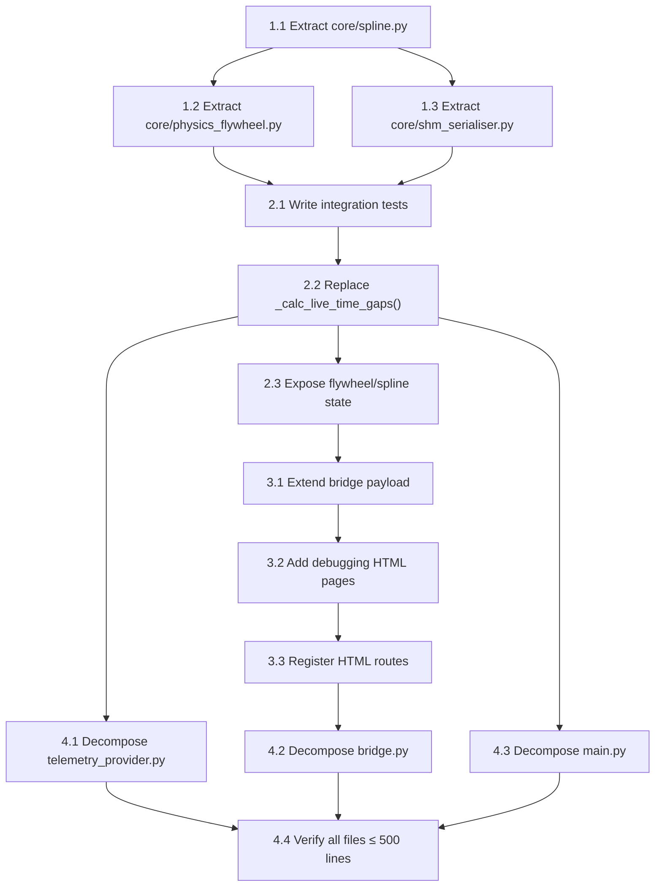

# Implementation Plan: Leaderboard Heart Transplant

**Feature Branch**: `13-leaderboard-heart-transplant`
**Created**: 2026-05-17
**Spec**: [spec.md](./spec.md)
**Methodology**: SDD/TDD — tests written before implementation code at every step

## Technical Context

| Aspect | Current State |
|--------|---------------|
| **Language** | Python 3.13 |
| **Framework** | tkinter (GUI), asyncio + websockets (bridge) |
| **Test Framework** | pytest (282 tests, ~0.34s) |
| **Data Source** | AMS2 SharedMemory (`$pcars2$`) + UDP fallback |
| **Time Gap (main)** | `_calc_live_time_gaps()` in `telemetry_provider.py` — per-car splines, `last_lap / track_length` fallback, no flywheel |
| **Time Gap (standalone)** | `DistanceTimeSpline` + `PhysicsFlywheel` in `shm_leaderboard_server.py` — single leader spline, system-clock synthesis, self-healing resync |
| **WebSocket Server** | `dashboard/bridge.py` on port 8765 — serves HTML pages + JSON payloads for F1TV overlays |

## Constitution Check

- ✅ TDD methodology enforced (FR-015)
- ✅ Strangler pattern for decomposition (FR-013)
- ✅ All existing tests pass at every step (SC-005)

---

## Phase 1: Extract Reusable Modules from Standalone Tool

### Goal
Extract `DistanceTimeSpline`, `PhysicsFlywheel`, and gap calculation functions from `tools/shm_leaderboard_server.py` into importable modules under `core/`. These become the single source of truth — both the standalone tool and the main program import from the same place.

### 1.1 Extract `core/spline.py` (~80 lines)

**What moves**:
- `DistanceTimeSpline` class (lines 120–195 of `shm_leaderboard_server.py`)
- `compute_total_distance()` function
- `compute_time_gap()` function

**TDD sequence**:
1. Write `tests/test_spline.py` importing from `core.spline` — copy relevant tests from `test_physics_flywheel.py` that test spline behaviour
2. Create `core/spline.py` with the extracted classes
3. Update `tools/shm_leaderboard_server.py` to `from core.spline import ...`
4. Verify: all 282+ tests pass

### 1.2 Extract `core/physics_flywheel.py` (~150 lines)

**What moves**:
- `PhysicsFlywheel` class (lines 197–356 of `shm_leaderboard_server.py`)
- Constants: `ANOMALY_THRESHOLD`, `RESYNC_AFTER`, `MAX_SYSTEM_DT`, `MIN_HEALTHY_SPEED`

**TDD sequence**:
1. Update `tests/test_physics_flywheel.py` imports to `from core.physics_flywheel import PhysicsFlywheel`
2. Create `core/physics_flywheel.py` with the class
3. Update `tools/shm_leaderboard_server.py` to import from `core.physics_flywheel`
4. Verify: all 282+ tests pass (existing 24 flywheel tests now test the extracted module directly)

### 1.3 Extract `core/shm_serialiser.py` (~110 lines)

**What moves**:
- `_serialise_struct()` / `serialise_shm()`
- `ENUM_MAP`, `ARRAY_ENUM_MAP`, `annotate_enums()`

**TDD sequence**:
1. Write `tests/test_shm_serialiser.py` with basic serialisation round-trip tests
2. Create `core/shm_serialiser.py`
3. Update both `tools/shm_leaderboard_server.py` and `dashboard/bridge.py` imports
4. Verify: all tests pass

**After Phase 1**: `tools/shm_leaderboard_server.py` drops from 587 → ~280 lines (server + loop only)

---

## Phase 2: Transplant Into Main Program

### Goal
Wire the extracted `core/spline.py` and `core/physics_flywheel.py` into the main program's telemetry pipeline, replacing the existing `_calc_live_time_gaps()` method.

### 2.1 Write integration tests FIRST

**New file**: `tests/test_leaderboard_integration.py`

Tests to write before any main program changes:
1. `test_flywheel_stabilises_time_in_main_pipeline` — mock SHM with a 40s time jump, assert gap calculations stay stable
2. `test_spline_continuous_across_leader_change` — simulate P1 swap, assert spline is never reset
3. `test_time_gap_matches_spline_interpolation` — for a known leader trajectory, assert `time_gap_to_leader` equals `current_time - spline.interpolate_time(dist)`
4. `test_flywheel_and_spline_same_tick` — assert spline.record and gap calc happen in the same tick, not on separate cadences
5. `test_session_reset_clears_spline` — assert spline is cleared on session state transition

### 2.2 Replace `_calc_live_time_gaps()` in `telemetry_provider.py`

**What changes**:
- Remove the entire `_calc_live_time_gaps()` method (~110 lines, 387–498)
- Remove `_car_splines` dict and its `get_spline_time_at_distance()` inner function
- Add `DistanceTimeSpline` and `PhysicsFlywheel` as instance attributes on `TelemetryProvider`
- In `poll()`, wire the flywheel stabilisation before gap calculation
- Use `spline.record(leader_dist, stabilized_time)` and `compute_time_gap()` for each driver

**Key wiring in `poll()`**:
```
# 1. Stabilise time
stabilized_time = self._flywheel.process(game_time, leader_dist)

# 2. Record to spline (same tick)
self._spline.record(leader_dist, stabilized_time)

# 3. Calculate gaps using stabilised time
for driver in participants:
    driver['time_gap_to_leader'] = compute_time_gap(driver_dist, stabilized_time, self._spline)
```

**Session boundary**: When `_detect_track_change()` fires, call `self._spline.reset()` and `self._flywheel.reset()`.

### 2.3 Expose flywheel/spline state for debugging

Add properties to `TelemetryProvider`:
- `flywheel_active: bool`
- `spline_data: dict` (distances, times for debugging payload)
- `flywheel_internal_clock: float`

These are consumed by the bridge to include in the WebSocket payload.

---

## Phase 3: Unified WebSocket & Debugging HTML

### Goal
Serve the spline debugger and SHM leaderboard HTML through the existing `dashboard/bridge.py` WebSocket server.

### 3.1 Extend bridge payload

**TDD**: Write `tests/test_bridge_payload.py` testing that the broadcast payload includes `spline`, `flywheel_active`, and `time_history` fields.

**Implementation**:
- In `DashboardBridge._build_payload()`, add:
  - `payload["spline"] = provider.spline_data`
  - `payload["flywheel_active"] = provider.flywheel_active`
  - `payload["time_history"] = provider.time_history`

### 3.2 Add HTML debugging pages

**Copy** from standalone tool and adapt WebSocket URL:
- `dashboard/spline_debugger.html` — distance-time table, speed column, mCurrentTime history
- `dashboard/shm_leaderboard.html` — sorted driver list with time gaps, flywheel badge

Both connect to `ws://localhost:8765` (bridge port) instead of standalone port 8770.

### 3.3 Register HTML routes in bridge

Add the new HTML files to the bridge's HTTP file server so they're accessible at:
- `http://localhost:8765/spline_debugger.html`
- `http://localhost:8765/shm_leaderboard.html`

---

## Phase 4: Strangler Refactor

### Goal
Decompose all Python files exceeding 500 total lines.

### Decomposition Plan

| File | Current | Strategy | Target Files |
|------|---------|----------|--------------|
| `core/telemetry_provider.py` | 848 | Extract UDP parsing → `core/udp_parser.py` (~300 lines). Extract SHM extraction → `core/shm_extractor.py` (~100 lines). Extract gap/speed calcs → already done in Phase 2. | `telemetry_provider.py` (~350), `udp_parser.py` (~300), `shm_extractor.py` (~100) |
| `main.py` | 632 | Extract `_build_ui()` + grid rendering → `core/gui_builder.py` (~200 lines). | `main.py` (~430), `gui_builder.py` (~200) |
| `tools/shm_leaderboard_server.py` | 587 | Already reduced to ~280 after Phase 1 extractions. | Done |
| `dashboard/bridge.py` | 581 | Extract payload building → `dashboard/payload_builder.py` (~150 lines). Extract SHM data parsing → uses `core/shm_serialiser.py` from Phase 1. | `bridge.py` (~400), `payload_builder.py` (~150) |

### TDD per extraction:
1. Write import-level tests for the new module
2. Extract the code
3. Update imports in the source file
4. Run full test suite — all 282+ tests must pass
5. Verify line count ≤ 500

---

## Execution Order & Dependencies



## Risk Mitigations

| Risk | Mitigation |
|------|------------|
| Import cycle between `core/` modules | Spline and Flywheel are leaf modules with zero internal dependencies |
| Bridge payload bloat | Spline data is opt-in (only sent when debugging HTML is connected) |
| Flywheel false-positives during 20x scrub | Threshold is 10s; 20x scrub produces ~5s deltas. Verified by existing test suite. |
| Regression during strangler steps | Full test suite runs after every extraction. TDD integration tests catch wiring bugs. |

## Test Strategy Summary

| Layer | Tests | Location |
|-------|-------|----------|
| **Unit — Spline** | Monotonicity, interpolation, extrapolation, reset | `tests/test_spline.py` |
| **Unit — Flywheel** | Anomaly detection, system-clock synthesis, resync, speed lie detector | `tests/test_physics_flywheel.py` (existing 24 tests) |
| **Integration — Pipeline** | End-to-end flywheel → spline → gap calc in main program context | `tests/test_leaderboard_integration.py` (new, TDD) |
| **Integration — Bridge** | Payload includes spline/flywheel data | `tests/test_bridge_payload.py` (new, TDD) |
| **Regression** | All 282+ existing tests | Full suite |
