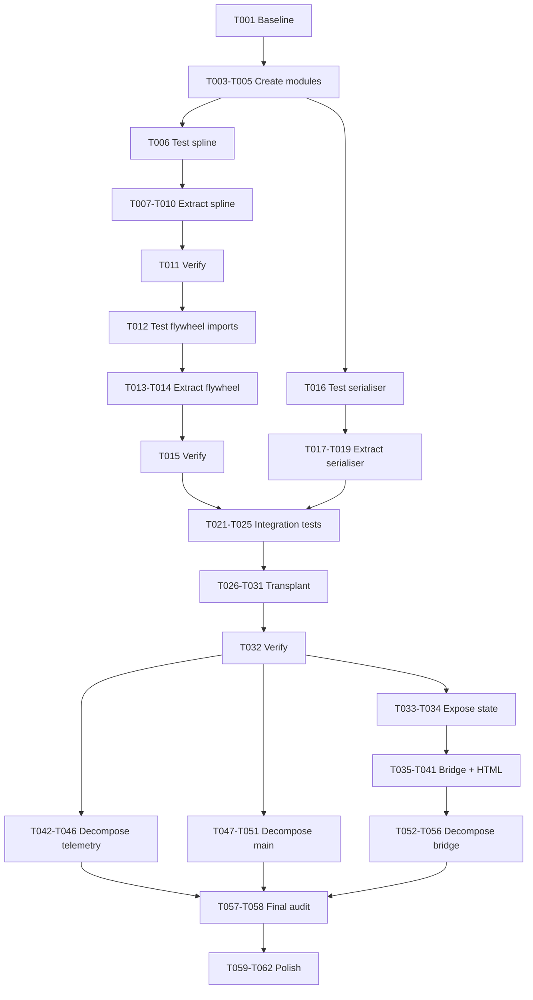

# Tasks: Leaderboard Heart Transplant

**Feature Branch**: `13-leaderboard-heart-transplant`
**Created**: 2026-05-17
**Methodology**: SDD/TDD — tests BEFORE code at every step
**Baseline**: 282 tests, all passing

## User Stories → Phase Mapping

| Story | Priority | Phase |
|-------|----------|-------|
| US1 — Stable Time Gaps in Main Program | P1 | Phase 3 (Extract) + Phase 4 (Transplant) |
| US2 — Debugging HTML Tools in Main Program | P1 | Phase 5 (WebSocket + HTML) |
| US3 — Strangler Refactor ≤ 500 Lines | P2 | Phase 6 (Decompose) |

---

## Phase 1: Setup

- [X] T001 Verify baseline — run full test suite, confirm 282 tests pass in `tests/`
- [X] T002 Verify file line counts — record current lines for `core/telemetry_provider.py`, `main.py`, `tools/shm_leaderboard_server.py`, `dashboard/bridge.py`

---

## Phase 2: Foundational — Create Target Module Files

- [X] T003 Create empty `core/spline.py` with module docstring describing single responsibility
- [X] T004 [P] Create empty `core/physics_flywheel.py` with module docstring describing single responsibility
- [X] T005 [P] Create empty `core/shm_serialiser.py` with module docstring describing single responsibility

---

## Phase 3: US1 — Extract Reusable Modules (Tests First)

### 3A: Extract `core/spline.py`

- [X] T006 [US1] **TEST** Write `tests/test_spline.py` importing `DistanceTimeSpline`, `compute_total_distance`, `compute_time_gap` from `core.spline` — audit `tests/test_physics_flywheel.py` and port spline-only tests (monotonicity, interpolation, extrapolation, reset, min_interval). Flywheel-coupled tests stay in `test_physics_flywheel.py`.
- [X] T007 [US1] Extract `DistanceTimeSpline` class from `tools/shm_leaderboard_server.py` (lines 118–195) into `core/spline.py`
- [X] T008 [US1] Extract `compute_total_distance()` function from `tools/shm_leaderboard_server.py` into `core/spline.py`
- [X] T009 [US1] Extract `compute_time_gap()` function from `tools/shm_leaderboard_server.py` into `core/spline.py`
- [X] T010 [US1] Update `tools/shm_leaderboard_server.py` to `from core.spline import DistanceTimeSpline, compute_total_distance, compute_time_gap`
- [X] T011 [US1] Run full test suite — confirm 282+ tests pass (baseline + new spline tests)

### 3B: Extract `core/physics_flywheel.py`

- [X] T012 [US1] Update `tests/test_physics_flywheel.py` imports to `from core.physics_flywheel import PhysicsFlywheel` (these will fail first).
- [X] T013 [US1] Extract `PhysicsFlywheel` class and constants from `tools/shm_leaderboard_server.py` into `core/physics_flywheel.py`
- [X] T014 [US1] Update `tools/shm_leaderboard_server.py` to `from core.physics_flywheel import PhysicsFlywheel`
- [X] T015 [US1] Run test suite — confirm tests pass.

### 3C: Extract `core/shm_serialiser.py`

- [X] T016 [US1] Extract `serialise_shm`, `_serialise_struct`, `annotate_enums` and Enum mapping dicts from `tools/shm_leaderboard_server.py` into `core/shm_serialiser.py`
- [X] T017 [US1] **TEST** Write `tests/test_shm_serialiser.py` by auditing `tests/test_shm_dump_tool.py` and porting all Phase 1 `test_serialise_*` tests.
- [X] T018 [US1] Update `tests/test_shm_serialiser.py` to import from `core.shm_serialiser`
- [X] T019 [US1] Update `tools/shm_leaderboard_server.py` to `from core.shm_serialiser import serialise_shm, annotate_enums`
- [X] T020 [US1] Run test suite — confirm all tests pass, and verify `tools/shm_leaderboard_server.py` is now ≤ 500 lines (target ~280)

---

## Phase 4: US1 — Transplant Into Main Program (Tests First)

### 4A: Write Integration Tests BEFORE Implementation

- [ ] T021 [US1] **TEST** Create `tests/test_leaderboard_integration.py` with `test_flywheel_stabilises_time_in_main_pipeline` — mock SHM with 40s time jump, assert gap calculations stay stable AND assert synthesised time comes from `time.monotonic()` (not speed×distance dead-reckoning)
- [ ] T022 [US1] **TEST** Add `test_spline_continuous_across_leader_change` — simulate P1 swap, assert spline is never reset
- [ ] T023 [US1] **TEST** Add `test_time_gap_matches_spline_interpolation` — for known leader trajectory, assert `time_gap_to_leader` equals `current_time - spline.interpolate_time(dist)`
- [ ] T024 [US1] **TEST** Add `test_flywheel_and_spline_same_tick` — mock `spline.record()` and `compute_time_gap()`, assert both are called within the same `poll()` invocation (use call-order tracking)
- [ ] T025 [US1] **TEST** Add `test_session_reset_clears_spline` — assert spline cleared on session state transition

### 4B: Replace `_calc_live_time_gaps()` in `core/telemetry_provider.py`

- [X] T026 [US1] Add `DistanceTimeSpline` and `PhysicsFlywheel` as instance attributes on `TelemetryProvider.__init__()` in `core/telemetry_provider.py`
- [X] T027 [US1] Wire flywheel stabilisation into `TelemetryProvider.poll()` — call `self._flywheel.process(game_time, leader_dist)` before gap calculation in `core/telemetry_provider.py`
- [X] T028 [US1] Wire spline recording into `TelemetryProvider.poll()` — call `self._spline.record(leader_dist, stabilized_time)` in same tick as gap calc in `core/telemetry_provider.py`
- [X] T029 [US1] Replace `_calc_live_time_gaps()` internals with `compute_time_gap(driver_dist, stabilized_time, self._spline)` for each driver in `core/telemetry_provider.py`
- [X] T030 [US1] Remove old `_car_splines` dict and `get_spline_time_at_distance()` inner function from `core/telemetry_provider.py`
- [X] T031 [US1] Wire session boundary — call `self._spline.reset()` and `self._flywheel.reset()` when `_detect_track_change()` fires OR session state changes (matching `should_reset_spline()` semantics) in `core/telemetry_provider.py`
- [X] T032 [US1] Run full test suite — confirm all integration tests (T021–T025) and existing 282+ tests pass

### 4C: Expose Flywheel/Spline State

- [X] T033 [US1] Add `flywheel_active`, `spline_data`, `flywheel_internal_clock`, `time_history` properties to `TelemetryProvider` in `core/telemetry_provider.py`
- [X] T034 [US1] Run full test suite — confirm all tests pass

---

## Phase 5: US2 — Debugging HTML Tools in Main Program (Tests First)

### 5A: Extend Bridge Payload

- [X] T035 [US2] **TEST** Write `tests/test_bridge_payload.py` testing that broadcast payload includes `spline`, `flywheel_active`, and `time_history` fields
- [X] T036 [US2] Extend `DashboardBridge._build_payload()` to include `spline`, `flywheel_active`, `time_history` from `TelemetryProvider` in `dashboard/bridge.py`
- [X] T037 [US2] Run full test suite — confirm payload tests pass

### 5B: Add HTML Debugging Pages

- [X] T038 [P] [US2] Create `dashboard/spline_debugger.html` — copy from standalone tool, update WebSocket URL to `ws://localhost:8765`, verify flywheel status badge element exists (FR-009)
- [X] T039 [P] [US2] Create `dashboard/shm_leaderboard.html` — copy from standalone tool, update WebSocket URL to `ws://localhost:8765`, verify flywheel status badge element exists (FR-009)
- [X] T040 [US2] Register new HTML files in bridge's HTTP file server in `dashboard/bridge.py`
- [X] T041 [US2] Verify both pages accessible at `http://localhost:8765/spline_debugger.html` and `http://localhost:8765/shm_leaderboard.html`

---

## Phase 6: US3 — Strangler Refactor ≤ 500 Lines (Tests First Per Extraction)

### 6A: Decompose `core/telemetry_provider.py` (848 lines → target ≤ 500)

- [ ] T042 [US3] **TEST** Write import-level tests for `core/udp_parser.py` in `tests/test_udp_parser.py`
- [ ] T043 [US3] Extract UDP parsing methods (`_listen_udp_loop`, `_parse_udp_names`, `_parse_udp_participants`, `_extract_udp_*`, `_add_packet_to_buffer`, `UDP_NATIONALITY_HASHES`) from `core/telemetry_provider.py` into `core/udp_parser.py`
- [ ] T044 [US3] Update `core/telemetry_provider.py` to import from `core.udp_parser`
- [ ] T045 [US3] Run full test suite — confirm all tests pass
- [ ] T046 [US3] Verify `core/telemetry_provider.py` is ≤ 500 lines

### 6B: Decompose `main.py` (632 lines → target ≤ 500)

- [x] T047 [US3] **TEST** Write import-level tests for `core/gui_builder.py` in `tests/test_gui_builder.py`
- [x] T048 [US3] Extract `_build_ui()` and grid rendering methods (`_update_grid`) from `main.py` into `core/gui_builder.py`
- [x] T049 [US3] Update `main.py` to import from `core/gui_builder.py`
- [x] T050 [US3] Run full test suite — confirm all tests pass
- [x] T051 [US3] Verify `main.py` is ≤ 500 lines

### 6C: Decompose `dashboard/bridge.py` (581 lines → target ≤ 500)

- [x] T052 [US3] **TEST** Write import-level tests for `dashboard/payload_builder.py` in `tests/test_payload_builder.py`
- [x] T053 [US3] Extract payload building methods from `dashboard/bridge.py` into `dashboard/payload_builder.py`
- [x] T054 [US3] Update `dashboard/bridge.py` to import from `dashboard.payload_builder`
- [x] T055 [US3] Run full test suite — confirm all tests pass
- [x] T056 [US3] Verify `dashboard/bridge.py` is ≤ 500 lines

### 6D: Final Line Count Audit

- [x] T057 [US3] Run line count audit across ALL `.py` files — confirm no file exceeds 500 total lines
- [x] T058 [US3] Verify every decomposed module has a module-level docstring (FR-012)

---

## Phase 7: Polish & Cross-Cutting

- [x] T059 Run full test suite one final time — confirm all tests pass (target 310+)
- [x] T060 Update `tools/shm_leaderboard_server.py` to use shared imports from `core/` (if any remaining direct definitions)
- [x] T061 Remove dead code — delete `_calc_live_time_gaps()` remnants and unused `_car_splines` references across all files
- [x] T062 Commit final state on `13-leaderboard-heart-transplant` branch

---

## Dependencies

## Parallel Opportunities

| Tasks | Why parallel |
|-------|-------------|
| T003, T004, T005 | Independent empty module creation |
| T016 (serialiser tests) and T006 (spline tests) | Different files, no shared dependency |
| T038, T039 | Independent HTML pages, no code dependency |
| T042–T046, T047–T051 | Independent decompositions touching different files |

## Implementation Strategy

**MVP Scope**: Phase 3 + Phase 4 (US1 only) — delivers stable time gaps in the main program with full TDD coverage. This is independently testable and valuable without the debugging HTML or strangler refactor.

**Incremental Delivery**:
1. Phases 1–2: Foundation (no user-visible change)
2. Phases 3–4: **MVP** — stable time gaps working in main program ✅
3. Phase 5: Debugging visibility ✅
4. Phase 6: Code health ✅
5. Phase 7: Cleanup ✅

## Summary

| Metric | Value |
|--------|-------|
| **Total tasks** | 62 |
| **US1 tasks** | 29 (T006–T034) |
| **US2 tasks** | 7 (T035–T041) |
| **US3 tasks** | 17 (T042–T058) |
| **Setup/Polish** | 9 (T001–T005, T059–T062) |
| **Test tasks (written BEFORE code)** | 14 (T006, T012, T016, T021–T025, T035, T042, T047, T052) |
| **Parallel opportunities** | 4 groups |
