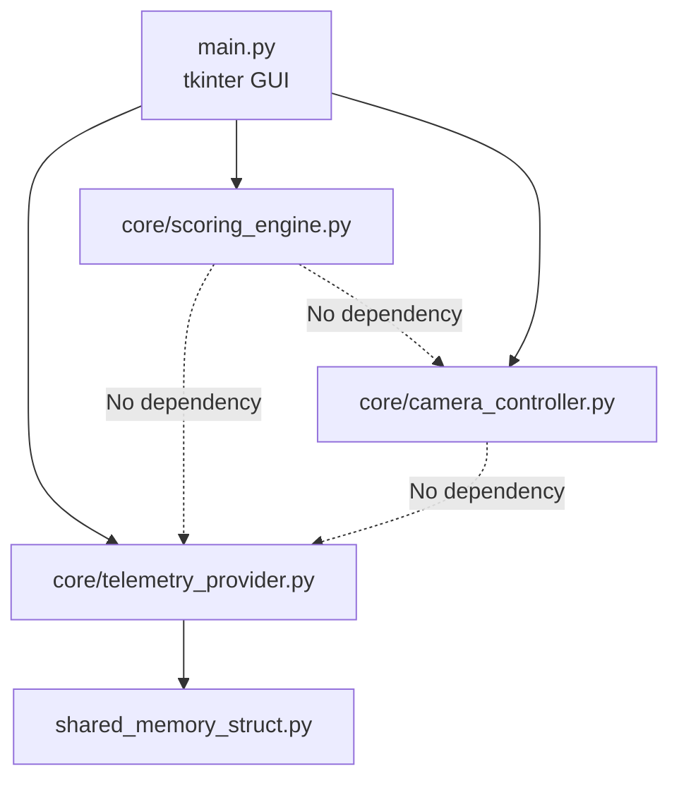

# Implementation Plan: AMS2 Auto Director V4.0 — Strangler Refactor

**Branch**: `feature/v4.0-strangler-refactor` | **Date**: 2026-05-03 | **Spec**: [spec.md](file:///c:/Users/markn/OneDrive/Documents/0-1Python/Auto%20Director%20Analyser/AMS2_Auto_Director4.0/.specify/features/v3_live_engine/spec.md)

## Summary

Decompose the 902-line monolithic `AMS2AutoDirector.py` into four testable modules using the Strangler Pattern. The GUI becomes a thin tkinter shell; all business logic (telemetry, scoring, camera control) lives in `core/` with zero UI imports. The `pandas` dependency is eliminated. Both UDP and Shared Memory data sources are preserved.

## Technical Context

**Language/Version**: Python 3.x (matches existing codebase)  
**Primary Dependencies**: `pyKey` (keyboard injection), `ctypes`/`mmap` (shared memory), `tkinter` (GUI — stdlib)  
**Storage**: N/A (stateless, in-memory only)  
**Testing**: `pytest` (unit tests for `core/` modules only — no tkinter testing)  
**Target Platform**: Windows (AMS2 is Windows-only, shared memory is Windows API)  
**Project Type**: Single desktop application  
**Performance Goals**: Scoring loop completes in <10ms per tick (32 participants). Camera keypress sequence <500ms for full grid traversal.  
**Constraints**: Key timing ≥10ms hold + 10ms gap per stroke. Shared Memory poll ≤200ms. GUI update ≤1s.  
**Scale/Scope**: 32 participants max, single user, single game instance.

## Constitution Check

No constitution file present. No gates to evaluate.

## Project Structure

### Documentation

```text
.specify/features/v3_live_engine/
├── spec.md              # Feature specification (migrated + clarified)
├── plan.md              # This file
├── research.md          # Phase 0: No external research needed
├── data-model.md        # Phase 1: Entity definitions
└── tasks.md             # Phase 2 output (generated by /speckit.tasks)
```

### Source Code

```text
AMS2_Auto_Director4.0/
├── main.py                      # Entry point — tkinter GUI shell
├── core/
│   ├── __init__.py
│   ├── telemetry_provider.py    # SharedMemory + UDP data ingestion
│   ├── scoring_engine.py        # Stateless per-tick scoring (no pandas)
│   └── camera_controller.py     # pyKey injection, delta navigation
├── shared_memory_struct.py      # Existing ctypes Structure (unchanged)
├── tests/
│   ├── __init__.py
│   ├── test_telemetry_provider.py
│   ├── test_scoring_engine.py
│   └── test_camera_controller.py
├── AMS2AutoDirector.py          # Legacy V3.0 monolith (preserved, not imported)
└── ReplayAutoDirector4.py       # Legacy V4.0 prototype (preserved, not imported)
```

**Structure Decision**: Single project with `core/` package for testable business logic and `tests/` for pytest. Legacy monoliths are preserved as reference but not imported by the new system.

## Phase 0: Research

No external research required. All technologies are already proven in the existing codebase. Key decisions were resolved during `/speckit.clarify`:
- **Game Time Sync**: `SharedMemory.mCurrentTime` — already available in the struct (line 223 of `shared_memory_struct.py`).
- **GUI Framework**: tkinter (stdlib, no install).
- **Data Layer**: Plain dicts replace pandas.
- **UDP**: Retained for backwards compatibility.

## Phase 1: Design

### Module Contracts

#### A. `core/telemetry_provider.py`

```python
class TelemetryProvider:
    """Abstraction over SharedMemory and UDP data sources."""
    
    def __init__(self, mode: str = "shared_memory"):
        """mode: 'shared_memory' or 'udp'"""
    
    def poll(self) -> dict[int, dict] | None:
        """Read current telemetry. Returns participants dict keyed 0-31,
        or None if data source unavailable.
        Each participant dict contains:
          - 'name': str
          - 'race_position': int
          - 'is_active': bool
          - 'lap_distance': float
          - 'current_lap': int
          - 'speed': float (m/s)
          - 'pit_mode': int
          - 'race_state': int
          - 'true_distance': float
          - 'gap_ahead': float (meters)
          - 'cars_ahead_250m': int
          - 'flag_colour': int
          - 'flag_reason': int
        """
    
    def get_game_time(self) -> float | None:
        """Return current game time from SharedMemory.mCurrentTime.
        Returns None if unavailable (e.g. UDP-only mode)."""
    
    def get_track_info(self) -> dict | None:
        """Return {'track_name': str, 'track_length': float, 'num_participants': int}
        or None if unavailable."""
    
    def is_connected(self) -> bool:
        """True if the data source is actively providing data."""
```

#### B. `core/scoring_engine.py`

```python
class ScoringEngine:
    """Stateless per-tick scoring. No memory of previous ticks."""
    
    # Configurable parameters (set from GUI)
    race_position_bonus_factor: float = 12
    pit_mode_penalty: float = -10
    speed_penalty: float = -5
    leader_cars_ahead_multiplier: float = 2
    other_cars_ahead_multiplier: float = 2
    close_racing_max_gap: float = 50
    close_racing_bonus_divisor: float = 5
    
    def calculate_scores(self, participants: dict[int, dict]) -> dict[int, dict]:
        """Calculate scores for all participants. Returns dict keyed by
        participant index, each value containing:
          - 'pit_mode_penalty': float
          - 'speed_penalty': float
          - 'cars_ahead_bonus': float
          - 'close_racing_bonus': float
          - 'race_position_bonus': float
          - 'total_score': float
        """
    
    def get_best_focus(self, scores: dict[int, dict],
                       participants: dict[int, dict]) -> int | None:
        """Return the race_position of the highest-scoring active participant,
        or None if no valid candidates."""
```

#### C. `core/camera_controller.py`

```python
class CameraController:
    """Manages pyKey injection for AMS2 camera switching."""
    
    key_hold_ms: float = 0.01   # 10ms hold
    key_gap_ms: float = 0.01    # 10ms gap between strokes
    
    def move_to_position(self, target_pos: int, current_pos: int | None):
        """Navigate from current_pos to target_pos using delta keypresses.
        If current_pos is None, scrolls to top first (fallback)."""
    
    def press_enter(self):
        """Confirm camera selection."""
    
    def switch_camera_type(self, camera_name: str):
        """Switch to a specific camera type (e.g., trackside, onboard)."""
```

#### D. `main.py` (GUI Shell)

```python
class AutoDirectorApp:
    """Thin tkinter GUI shell. Owns no business logic."""
    
    def __init__(self):
        self.provider = TelemetryProvider(mode)
        self.scorer = ScoringEngine()
        self.camera = CameraController()
    
    # GUI responsibilities:
    # - Display leaderboard grid (populated from provider.poll() + scorer.calculate_scores())
    # - Show connection status ("Waiting for AMS2..." / "Connected to AMS2")
    # - Expose tuning parameters that map to scorer.* attributes
    # - Run main tick loop via root.after()
    # - Toggle auto director via spacebar hotkey
```

### Dependency Graph



Key design principle: **B, C, and D have zero dependencies on each other.** The GUI orchestrates them. This means each can be unit-tested in complete isolation.

## TDD Test Plan — Tests Before Code

All tests are written **before** the corresponding module code. Each test file lives in `tests/` and imports only from `core/`. No tkinter, no live AMS2 connection required.

### `tests/test_scoring_engine.py` — Pure Math Validation

#### Pit Mode Penalty
| # | Test | Input | Expected |
|---|---|---|---|
| SE-01 | Pit penalty applied when pit_mode != 0 | `pit_mode=2` | `pit_mode_penalty = -10` |
| SE-02 | No penalty when pit_mode == 0 | `pit_mode=0` | `pit_mode_penalty = 0` |
| SE-03 | Cars ahead bonus zeroed when in pits | `pit_mode=1, cars_ahead_250m=3` | `cars_ahead_bonus = 0` |

#### Speed Penalty
| # | Test | Input | Expected |
|---|---|---|---|
| SE-04 | Speed penalty when stationary | `speed=0` | `speed_penalty = -5` |
| SE-05 | Speed penalty at 4.9 m/s | `speed=4.9` | `speed_penalty = -5` |
| SE-06 | No penalty at 5.0 m/s | `speed=5.0` | `speed_penalty = 0` |
| SE-07 | No penalty at racing speed | `speed=80` | `speed_penalty = 0` |

#### Cars Ahead Bonus
| # | Test | Input | Expected |
|---|---|---|---|
| SE-08 | Leader with 3 cars ahead | `race_position=1, cars_ahead_250m=3` | `cars_ahead_bonus = 6.0` (3*2) |
| SE-09 | Non-leader with 3 cars ahead | `race_position=5, cars_ahead_250m=3` | `cars_ahead_bonus = 1.2` (3*2/5) |
| SE-10 | Zero cars ahead | `cars_ahead_250m=0` | `cars_ahead_bonus = 0` |

#### Close Racing Bonus
| # | Test | Input | Expected |
|---|---|---|---|
| SE-11 | Gap of 10m (close battle) | `gap_ahead=10` | `close_racing_bonus = 8.0` ((50-10)/5) |
| SE-12 | Gap of 50m (edge of threshold) | `gap_ahead=50` | `close_racing_bonus = 0.0` ((50-50)/5) |
| SE-13 | Gap of 51m (outside threshold) | `gap_ahead=51` | `close_racing_bonus = 0` |
| SE-14 | Gap of 0m (leader / no gap) | `gap_ahead=0` | `close_racing_bonus = 0` |
| SE-15 | Gap of 1m (nose-to-tail) | `gap_ahead=1` | `close_racing_bonus = 9.8` ((50-1)/5) |

#### Race Position Bonus
| # | Test | Input | Expected |
|---|---|---|---|
| SE-16 | P1 gets full bonus | `race_position=1` | `race_position_bonus = 12.0` |
| SE-17 | P32 gets near-zero bonus | `race_position=32` | `race_position_bonus ≈ 0.375` |
| SE-18 | P0 (invalid) returns 0 | `race_position=0` | `race_position_bonus = 0` |
| SE-19 | P16 (midfield) | `race_position=16` | `race_position_bonus ≈ 6.375` |

#### Total Score Aggregation
| # | Test | Input | Expected |
|---|---|---|---|
| SE-20 | All components sum correctly | Mixed scenario | `total_score = sum of all 5 components` |
| SE-21 | Empty participants dict | `{}` | Returns empty scores dict |
| SE-22 | Single active participant | 1 entry | Returns single score entry |

#### Best Focus Selection
| # | Test | Input | Expected |
|---|---|---|---|
| SE-23 | Highest scorer selected | 3 participants, varied scores | Returns `race_position` of highest |
| SE-24 | All inactive → None | All `is_active=False` | Returns `None` |
| SE-25 | Tie-breaking | Two equal scores | Returns either (deterministic) |
| SE-26 | Pit drivers excluded from focus | Highest score is in pits | Returns next-highest non-pit driver |

#### Configurable Parameters
| # | Test | Input | Expected |
|---|---|---|---|
| SE-27 | Modified race_position_bonus_factor | `factor=20` | P1 bonus = 20.0 |
| SE-28 | Modified close_racing_max_gap | `max_gap=100, gap=75` | `bonus = 5.0` ((100-75)/5) |
| SE-29 | Modified pit_mode_penalty | `penalty=-20` | Applied correctly |

---

### `tests/test_telemetry_provider.py` — Data Extraction Validation

All tests use a **MockSharedMemory** fixture — a fake `ctypes.Structure` populated with known values. No live AMS2 required.

#### Shared Memory Extraction
| # | Test | Input (MockSharedMemory fields) | Expected |
|---|---|---|---|
| TP-01 | Active participant extracted | `mIsActive=True, mName=b"Alice", mRacePosition=3` | `{'name': 'Alice', 'race_position': 3, 'is_active': True}` |
| TP-02 | Inactive participant skipped | `mIsActive=False` | `is_active=False` in output |
| TP-03 | Driver name decoded and stripped | `mName=b"Bob\x00\x00\x00"` | `name = "Bob"` |
| TP-04 | Track info extracted | `mTrackLocation=b"Interlagos", mTrackLength=4309.0` | `{'track_name': 'Interlagos', 'track_length': 4309.0}` |
| TP-05 | Game time read from mCurrentTime | `mCurrentTime=125.5` | `get_game_time() == 125.5` |

#### True Distance Calculation
| # | Test | Input | Expected |
|---|---|---|---|
| TP-06 | Lap 0 at 500m | `laps_completed=0, lap_distance=500, track_length=4000` | `true_distance = 500` |
| TP-07 | Lap 3 at 1000m | `laps_completed=3, lap_distance=1000, track_length=4000` | `true_distance = 13000` |
| TP-08 | Lap 0 at 0m (grid start) | `laps_completed=0, lap_distance=0` | `true_distance = 0` |

#### Gap Calculation
| # | Test | Input (2 participants) | Expected |
|---|---|---|---|
| TP-09 | Simple gap | P1 at 5000m, P2 at 4800m | P2 `gap_ahead = 200` |
| TP-10 | Leader has gap of 0 | P1 is first | P1 `gap_ahead = 0` |
| TP-11 | Multiple participants sorted correctly | 5 drivers at varied distances | Gaps calculated in order |

#### Cars Ahead 250m
| # | Test | Input | Expected |
|---|---|---|---|
| TP-12 | One car 100m ahead | Two participants, 100m apart | `cars_ahead_250m = 1` |
| TP-13 | Car 300m ahead (outside range) | Two participants, 300m apart | `cars_ahead_250m = 0` |
| TP-14 | S/F line wrapping | P1 at 3900m, P2 at 100m (track_length=4000) | Correctly counts wrap-around |

#### Speed Calculation
| # | Test | Input (two sequential polls) | Expected |
|---|---|---|---|
| TP-15 | Normal speed | distances=[100, 200], timestamps=[0, 1] | `speed = 100 m/s` |
| TP-16 | S/F crossing | distances=[3900, 100], track_length=4000, timestamps=[0, 1] | `speed = 200 m/s` |
| TP-17 | Stationary | distances=[500, 500], timestamps=[0, 1] | `speed = 0` |
| TP-18 | First poll (insufficient data) | Single distance entry | `speed = None` |

#### Connection State
| # | Test | Input | Expected |
|---|---|---|---|
| TP-19 | is_connected when data available | `poll()` returns valid dict | `is_connected() == True` |
| TP-20 | is_connected when no data | `poll()` returns None | `is_connected() == False` |

#### Track Change Detection
| # | Test | Input | Expected |
|---|---|---|---|
| TP-21 | Track change resets participants | Poll with track A, then poll with track B | All participant data reset |

#### UDP Data Source (Backwards Compatibility)
| # | Test | Input | Expected |
|---|---|---|---|
| TP-22 | UDP mode initialises socket | `TelemetryProvider(mode='udp')` | Socket bound, no crash |
| TP-23 | UDP packet buffer retains latest packet per type | Two packets of same size | Buffer has 1 entry |
| TP-24 | UDP extended packet parsed to participant dict | Known 1063-byte packet | Correct race_position, lap_distance for participant 0 |

#### Connection State Transitions (Edge Cases EC-1, EC-2)
| # | Test | Input | Expected |
|---|---|---|---|
| TP-25 | Disconnected → Connected transition | `poll()` returns None then valid dict | `is_connected()` transitions False→True |
| TP-26 | Connected → Disconnected → Reconnected | Valid → None → Valid sequence | `is_connected()` transitions True→False→True, participant data reset on reconnect |

---

### `tests/test_camera_controller.py` — Keyboard Injection Validation

All tests use a **mock pyKey** (monkeypatch `pressKey`/`releaseKey`) to capture key sequences without injecting real input.

#### Delta Navigation
| # | Test | Input | Expected key sequence |
|---|---|---|---|
| CC-01 | Move from P1 to P5 | `target=5, current=1` | 4x DOWN |
| CC-02 | Move from P10 to P3 | `target=3, current=10` | 7x UP |
| CC-03 | Same position (no move) | `target=5, current=5` | No keys pressed |
| CC-04 | Move from P1 to P1 | `target=1, current=1` | No keys pressed |

#### Fallback Navigation (current_pos is None)
| # | Test | Input | Expected key sequence |
|---|---|---|---|
| CC-05 | Fallback to P1 | `target=1, current=None` | 32x UP, 0x DOWN |
| CC-06 | Fallback to P10 | `target=10, current=None` | 32x UP, 9x DOWN |
| CC-07 | Fallback to P32 | `target=32, current=None` | 32x UP, 31x DOWN |

#### Key Timing
| # | Test | Input | Expected |
|---|---|---|---|
| CC-08 | Hold duration ≥ 10ms | Any move | `time.sleep(0.01)` called after each `pressKey` |
| CC-09 | Gap duration ≥ 10ms | Any move | `time.sleep(0.01)` called after each `releaseKey` |
| CC-10 | ENTER pressed after move | Any move | Final key is ENTER press+release |

#### Edge Cases
| # | Test | Input | Expected |
|---|---|---|---|
| CC-11 | Target P0 (invalid) | `target=0` | No keys pressed (guard clause) |
| CC-12 | Target P33 (out of range) | `target=33` | No keys pressed (guard clause) |
| CC-13 | Large delta (P1 to P32) | `target=32, current=1` | 31x DOWN + timing verified |

---

### Test Execution Strategy

| Phase | What | Command | Gate |
|---|---|---|---|
| 1 | Write `test_scoring_engine.py` (SE-01 to SE-29) | `pytest tests/test_scoring_engine.py` | All 29 tests FAIL (no implementation yet) |
| 2 | Implement `core/scoring_engine.py` | `pytest tests/test_scoring_engine.py` | All 29 tests PASS |
| 3 | Write `test_telemetry_provider.py` (TP-01 to TP-26) | `pytest tests/test_telemetry_provider.py` | All 26 tests FAIL |
| 4 | Implement `core/telemetry_provider.py` | `pytest tests/test_telemetry_provider.py` | All 26 tests PASS |
| 5 | Write `test_camera_controller.py` (CC-01 to CC-13) | `pytest tests/test_camera_controller.py` | All 13 tests FAIL |
| 6 | Implement `core/camera_controller.py` | `pytest tests/test_camera_controller.py` | All 13 tests PASS |
| 7 | Full regression | `pytest tests/` | All 68 tests PASS |
| 8 | Wire `main.py` GUI shell | Manual launch | Visual verification |

**Total test count: 68 tests across 3 modules.**

## Strangler Execution Order

| Step | Action | Risk | Validation |
|---|---|---|---|
| 1 | Write `tests/test_scoring_engine.py` (29 tests) | None — tests only | All fail (RED) |
| 2 | Create `core/scoring_engine.py` | Low — pure math, no I/O | All 29 pass (GREEN) |
| 3 | Write `tests/test_telemetry_provider.py` (26 tests) | None — tests only | All fail (RED) |
| 4 | Create `core/telemetry_provider.py` | Medium — ctypes/mmap mock | All 26 pass (GREEN) |
| 5 | Write `tests/test_camera_controller.py` (13 tests) | None — tests only | All fail (RED) |
| 6 | Create `core/camera_controller.py` | Low — thin pyKey wrapper | All 13 pass (GREEN) |
| 7 | Full regression | — | All 68 pass |
| 8 | Create `main.py` GUI shell | Low — wiring only | Manual launch test |
| 9 | Verify end-to-end | Medium | Launch with AMS2 running |

## Complexity Tracking

No constitution violations. No complexity justifications needed.
