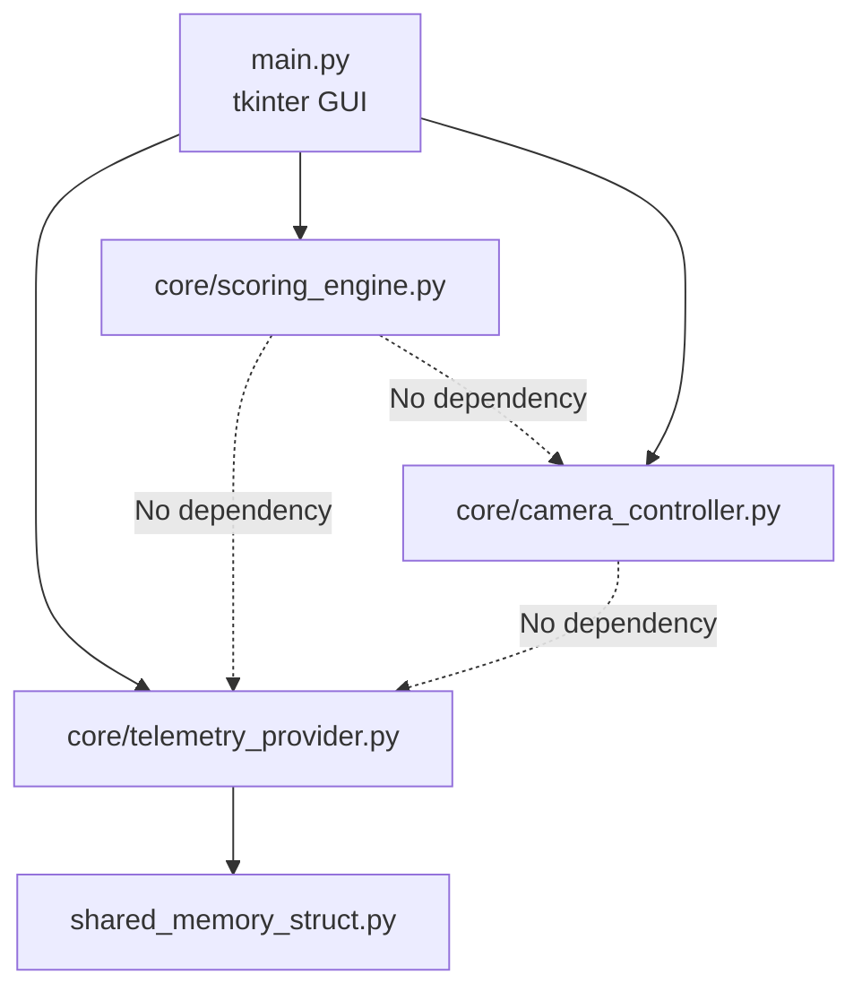

# Implementation Plan: AMS2 Auto Director V4.0 — Strangler Refactor

**Branch**: `feature/v4.0-strangler-refactor` | **Date**: 2026-05-03 | **Spec**: [spec.md](file:///c:/Users/markn/OneDrive/Documents/0-1Python/Auto%20Director%20Analyser/AMS2_Auto_Director4.0/.specify/features/v3_live_engine/spec.md)

## Summary

Decompose the 902-line monolithic `AMS2AutoDirector.py` into four testable modules using the Strangler Pattern. The GUI becomes a thin tkinter shell; all business logic (telemetry, scoring, camera control) lives in `core/` with zero UI imports. The `pandas` dependency is eliminated. Both UDP and Shared Memory data sources are preserved.

## Technical Context

**Language/Version**: Python 3.x (matches existing codebase)  
**Primary Dependencies**: `pyKey` (keyboard injection), `ctypes`/`mmap` (shared memory), `tkinter` (GUI — stdlib)  
**Storage**: N/A (stateless, in-memory only)  
**Testing**: `pytest` (unit tests for `core/` modules only — no tkinter testing)  
**Target Platform**: Windows (AMS2 is Windows-only, shared memory is Windows API)  
**Project Type**: Single desktop application  
**Performance Goals**: Scoring loop completes in <10ms per tick (32 participants). Camera keypress sequence <500ms for full grid traversal.  
**Constraints**: Key timing ≥10ms hold + 10ms gap per stroke. Shared Memory poll ≤200ms. GUI update ≤1s.  
**Scale/Scope**: 32 participants max, single user, single game instance.

## Constitution Check

No constitution file present. No gates to evaluate.

## Project Structure

### Documentation

```text
.specify/features/v3_live_engine/
├── spec.md              # Feature specification (migrated + clarified)
├── plan.md              # This file
├── research.md          # Phase 0: No external research needed
├── data-model.md        # Phase 1: Entity definitions
└── tasks.md             # Phase 2 output (generated by /speckit.tasks)
```

### Source Code

```text
AMS2_Auto_Director4.0/
├── main.py                      # Entry point — tkinter GUI shell
├── core/
│   ├── __init__.py
│   ├── telemetry_provider.py    # SharedMemory + UDP data ingestion
│   ├── scoring_engine.py        # Stateless per-tick scoring (no pandas)
│   └── camera_controller.py     # pyKey injection, delta navigation
├── shared_memory_struct.py      # Existing ctypes Structure (unchanged)
├── tests/
│   ├── __init__.py
│   ├── test_telemetry_provider.py
│   ├── test_scoring_engine.py
│   └── test_camera_controller.py
├── AMS2AutoDirector.py          # Legacy V3.0 monolith (preserved, not imported)
└── ReplayAutoDirector4.py       # Legacy V4.0 prototype (preserved, not imported)
```

**Structure Decision**: Single project with `core/` package for testable business logic and `tests/` for pytest. Legacy monoliths are preserved as reference but not imported by the new system.

## Phase 0: Research

No external research required. All technologies are already proven in the existing codebase. Key decisions were resolved during `/speckit.clarify`:
- **Game Time Sync**: `SharedMemory.mCurrentTime` — already available in the struct (line 223 of `shared_memory_struct.py`).
- **GUI Framework**: tkinter (stdlib, no install).
- **Data Layer**: Plain dicts replace pandas.
- **UDP**: Retained for backwards compatibility.

## Phase 1: Design

### Module Contracts

#### A. `core/telemetry_provider.py`

```python
class TelemetryProvider:
    """Abstraction over SharedMemory and UDP data sources."""
    
    def __init__(self, mode: str = "shared_memory"):
        """mode: 'shared_memory' or 'udp'"""
    
    def poll(self) -> dict[int, dict] | None:
        """Read current telemetry. Returns participants dict keyed 0-31,
        or None if data source unavailable.
        Each participant dict contains:
          - 'name': str
          - 'race_position': int
          - 'is_active': bool
          - 'lap_distance': float
          - 'current_lap': int
          - 'speed': float (m/s)
          - 'pit_mode': int
          - 'race_state': int
          - 'true_distance': float
          - 'gap_ahead': float (meters)
          - 'cars_ahead_250m': int
          - 'flag_colour': int
          - 'flag_reason': int
        """
    
    def get_game_time(self) -> float | None:
        """Return current game time from SharedMemory.mCurrentTime.
        Returns None if unavailable (e.g. UDP-only mode)."""
    
    def get_track_info(self) -> dict | None:
        """Return {'track_name': str, 'track_length': float, 'num_participants': int}
        or None if unavailable."""
    
    def is_connected(self) -> bool:
        """True if the data source is actively providing data."""
```

#### B. `core/scoring_engine.py`

```python
class ScoringEngine:
    """Stateless per-tick scoring. No memory of previous ticks."""
    
    # Configurable parameters (set from GUI)
    race_position_bonus_factor: float = 12
    pit_mode_penalty: float = -10
    speed_penalty: float = -5
    leader_cars_ahead_multiplier: float = 2
    other_cars_ahead_multiplier: float = 2
    close_racing_max_gap: float = 50
    close_racing_bonus_divisor: float = 5
    
    def calculate_scores(self, participants: dict[int, dict]) -> dict[int, dict]:
        """Calculate scores for all participants. Returns dict keyed by
        participant index, each value containing:
          - 'pit_mode_penalty': float
          - 'speed_penalty': float
          - 'cars_ahead_bonus': float
          - 'close_racing_bonus': float
          - 'race_position_bonus': float
          - 'total_score': float
        """
    
    def get_best_focus(self, scores: dict[int, dict],
                       participants: dict[int, dict]) -> int | None:
        """Return the race_position of the highest-scoring active participant,
        or None if no valid candidates."""
```

#### C. `core/camera_controller.py`

```python
class CameraController:
    """Manages pyKey injection for AMS2 camera switching."""
    
    key_hold_ms: float = 0.01   # 10ms hold
    key_gap_ms: float = 0.01    # 10ms gap between strokes
    
    def move_to_position(self, target_pos: int, current_pos: int | None):
        """Navigate from current_pos to target_pos using delta keypresses.
        If current_pos is None, scrolls to top first (fallback)."""
    
    def press_enter(self):
        """Confirm camera selection."""
    
    def switch_camera_type(self, camera_name: str):
        """Switch to a specific camera type (e.g., trackside, onboard)."""
```

#### D. `main.py` (GUI Shell)

```python
class AutoDirectorApp:
    """Thin tkinter GUI shell. Owns no business logic."""
    
    def __init__(self):
        self.provider = TelemetryProvider(mode)
        self.scorer = ScoringEngine()
        self.camera = CameraController()
    
    # GUI responsibilities:
    # - Display leaderboard grid (populated from provider.poll() + scorer.calculate_scores())
    # - Show connection status ("Waiting for AMS2..." / "Connected to AMS2")
    # - Expose tuning parameters that map to scorer.* attributes
    # - Run main tick loop via root.after()
    # - Toggle auto director via spacebar hotkey
```

### Dependency Graph



Key design principle: **B, C, and D have zero dependencies on each other.** The GUI orchestrates them. This means each can be unit-tested in complete isolation.

## Strangler Execution Order

| Step | Action | Risk | Validation |
|---|---|---|---|
| 1 | Create `core/scoring_engine.py` | Low — pure math, no I/O | `pytest test_scoring_engine.py` |
| 2 | Create `core/telemetry_provider.py` | Medium — ctypes/mmap | `pytest test_telemetry_provider.py` (mock SharedMemory) |
| 3 | Create `core/camera_controller.py` | Low — thin pyKey wrapper | `pytest test_camera_controller.py` (mock pyKey) |
| 4 | Create `main.py` GUI shell | Low — wiring only | Manual launch test |
| 5 | Verify end-to-end | Medium | Launch with AMS2 running |

## Complexity Tracking

No constitution violations. No complexity justifications needed.
