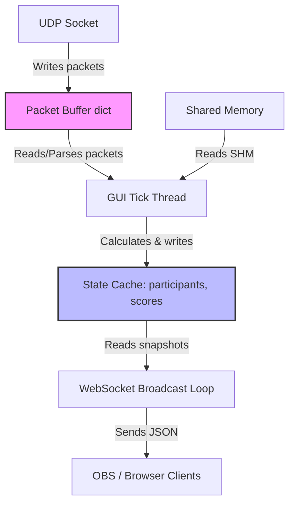

# Data Model & Synchronization Design: Streamline OBS Performance

This document defines the data structures and locking strategy used to ensure thread safety across the UDP receiver, GUI tick, and WebSocket broadcast threads.

## Threading Model

The application operates across three concurrent execution contexts:
1. **UDP Receiver Thread**: Listens on the UDP socket, parses basic names/metadata, and buffers raw packets.
2. **GUI/Main Thread**: Periodically ticks (every 200ms), reads the packet buffer and shared memory, performs physics flywheel/spline calculations, updates internal scoring, and refreshes the Tkinter GUI.
3. **WebSocket/Bridge Thread**: Runs an asyncio event loop, serves HTTP overlay assets, reads state snapshots, and broadcasts WebSocket updates to clients at 4Hz.



## Shared Data Structures & Synchronization

### 1. `PacketSlot` (Thread-Safe Packet Buffer)
Each entry in the telemetry provider's packet buffer represents a separate packet size/type. To track new packets and dropped packets without lock contention, we wrap raw packets in a helper class.

```python
class PacketSlot:
    def __init__(self):
        self.packet: bytes | None = None
        self.seq: int = 0
        self.read_by_poll: bool = False
        self.read_by_bridge: bool = False
```

- **Synchronization**: Protected by `TelemetryProvider._packet_buffer_lock`.
- **Write Path (UDP Thread)**:
  1. Acquire `_packet_buffer_lock`.
  2. Retrieve or create `PacketSlot` for the packet size.
  3. If `slot.packet is not None` and not (`slot.read_by_poll` or `slot.read_by_bridge`), increment `_dropped_packets_counter`.
  4. Overwrite `slot.packet` with new packet bytes.
  5. Increment `slot.seq`.
  6. Reset `slot.read_by_poll = False` and `slot.read_by_bridge = False`.
  7. Release `_packet_buffer_lock`.
- **Read Path (GUI / WebSocket Threads)**:
  - Return a thread-safe snapshot of packets by copying the dictionary and marking slots as read under `_packet_buffer_lock`.

---

### 2. UDP Metadata Cache
TelemetryProvider maintains metadata caches (participant names, nationalities, car names, classes) populated dynamically from UDP string packets (1136 and 1367 bytes).

- **Fields**:
  - `_udp_participant_names: dict[int, str]`
  - `_udp_participant_nationalities: dict[int, str]`
  - `_udp_car_names: dict[int, str]`
  - `_udp_car_classes: dict[int, str]`
  - `_udp_time_splits: dict[int, float]`
- **Synchronization**: Protected by `TelemetryProvider._udp_lock`. All writes (in `_parse_udp_names`) and reads (in `poll()`) must acquire this lock.

---

### 3. Core Telemetry & Spline Cache
Tracks active driver positions, gaps, and DistanceTimeSpline history.

- **Fields**:
  - `_leader_spline: DistanceTimeSpline`
  - `_distance_history: dict[int, list]`
  - `_gap_history: dict[int, float]`
  - `_closing_speed_ema: dict[int, float]`
- **Synchronization**: Protected by `TelemetryProvider._lock`. All updates in `poll()` and spline reads (like `spline_data` property) acquire this lock.

---

### 4. Global GUI State Cache
The computed scoring and participant outputs must be transferred safely to the WebSocket thread for transmission to overlays.

- **Fields**:
  - `_participants: dict[int, dict]` (in `AutoDirectorApp`)
  - `_scores: dict[int, dict]` (in `AutoDirectorApp`)
  - `_shm: SharedMemory` (latest read shared memory object)
- **Synchronization**: Protected by `AutoDirectorApp._state_lock`.
  - GUI thread acquires `_state_lock` to write `_participants`, `_scores`, and `_shm` once at the end of each tick.
  - WebSocket thread acquires `_state_lock` to retrieve copies of `participants`, `scores`, and `_shm` before serialization.
