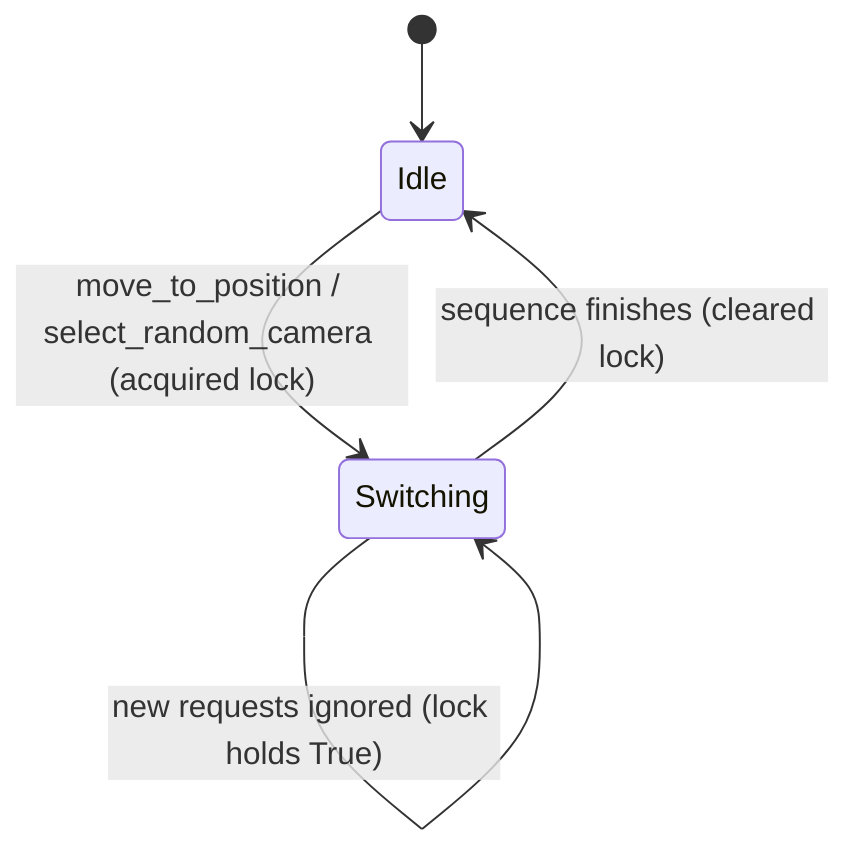

# Internal State & Concurrency Model: Non-Blocking Camera Switches

This document details the updated concurrency and state attributes of the `CameraController` class.

## Internal State Attributes

The `CameraController` class manages the following properties:

| Attribute | Type | Thread Safety | Description |
|-----------|------|---------------|-------------|
| `current_camera_type` | `str` | Thread-Safe (Atomic Read/Write) | The current active camera set name (e.g. `"tv_cam"`, `"cockpit"`, `"chase"`, `"roof"`). Read by the main GUI thread and the Dashboard Bridge thread. |
| `disable_camera_change` | `bool` | Thread-Safe (Atomic Read/Write) | Flag indicating if auto camera switching is paused. Modified by GUI toggles. |
| `last_shot_was_special` | `bool` | Thread-Safe (Atomic Read/Write) | Tracks anchor state for camera selection pools. Read/Written during random camera selection. |
| `_switch_lock` | `threading.Lock` | Thread-Safe | Mutex protecting access to `_switching_in_progress`. |
| `_switching_in_progress` | `bool` | Guarded by `_switch_lock` | Indicates if an active background thread is currently injecting keypresses. |

---

## State Transition Lifecycle

1. **Idle**: The controller is ready to accept a camera switch. `_switching_in_progress` is `False`.
2. **Switching**: A camera switch is triggered. A background thread is spawned, `_switching_in_progress` is set to `True`.
3. **Ignored Requests**: Any subsequent switch requests received while in the `Switching` state are discarded immediately.
4. **Completion**: Once the keystroke injections and delays are completed, the background thread clears `_switching_in_progress` to `False`, returning the controller to `Idle`.
