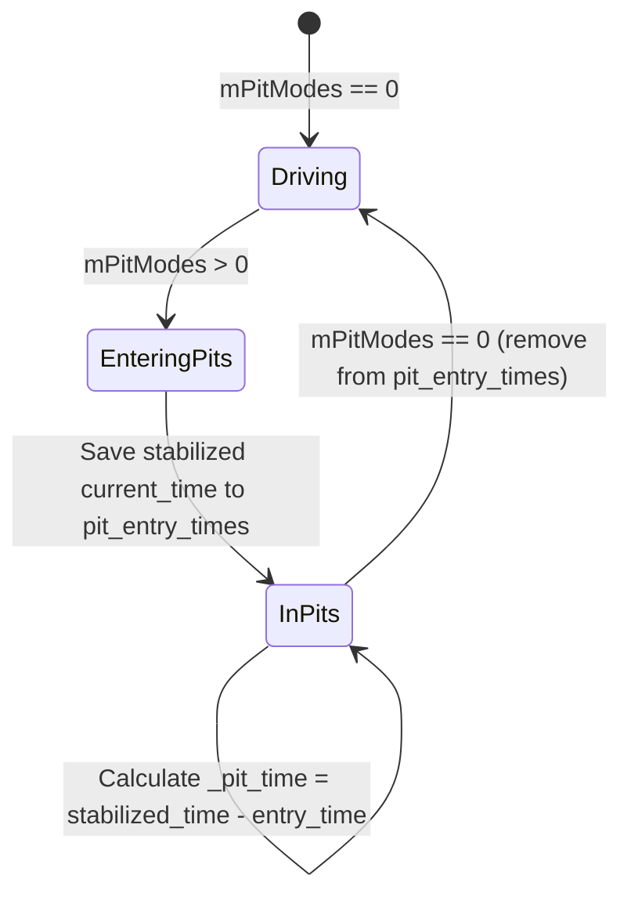

# Data Model: Standalone Server Flywheel Pitstop Times

This document describes the state variables and dictionary formats used to track pitstop timings in the standalone SHM leaderboard server.

## State Definitions

### `pit_entry_times` Dictionary
The `pit_entry_times` dictionary is a mutable state object passed into `correlate_drivers`. It tracks the stabilized game time when each driver enters the pit lane:

- **Key**: `driver_name` (`str`) — Unique name of the participant.
- **Value**: `entry_time` (`float`) — The flywheel-stabilized `current_time` when the driver was first detected in a pit mode (`mPitModes > 0`).

### Participant Dictionary Outputs
Each participant dictionary in the `leaderboard` list output by `correlate_drivers` is annotated with these calculated properties:

| Key | Type | Description |
|-----|------|-------------|
| `_in_pits` | `bool` | `True` if `mPitModes > 0`, indicating the driver is currently in the pit lane or garage. |
| `_pit_time` | `float` \| `None` | The elapsed time spent in the pits, calculated as `current_time - entry_time` (using stabilized time), or `None` if not in pits. |

---

## State Transition Flow

